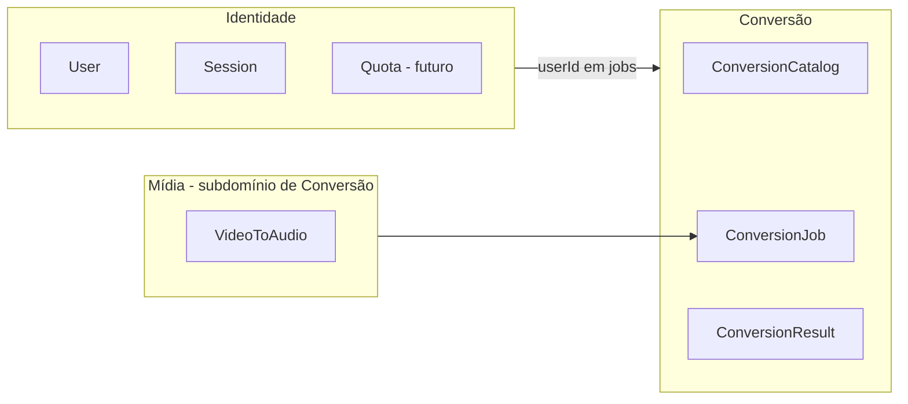

# Bounded Contexts

Mapa de contextos delimitados (DDD) do [[Projeto Com Hans]].

## Diagrama de contextos

## Contexto: Conversão

**Linguagem ubíqua:** arquivo, par, job, conversor, resultado, falha, TTL.

**Agregado raiz:** `ConversionJob`

**Responsabilidades:**
- Validar se par está no catálogo e habilitado para a release atual.
- Orquestrar ciclo de vida: `pending` → `processing` → `completed` | `failed`.
- Associar arquivos temporários de entrada e saída.

**Não faz:** autenticar usuário (delega ao contexto Identidade).

## Contexto: Identidade

**Linguagem ubíqua:** usuário, sessão, token, provedor (Google, email).

**Agregado raiz:** `AuthenticatedUser` (thin — Firebase é source of truth)

**Responsabilidades:**
- Resolver sessão a partir do token Firebase.
- Expor `userId` para jobs e histórico futuro.
- Quotas e planos (fase 2+).

**Integração:** Firebase Auth via adapter — ver [[Firebase Auth]].

## Contexto futuro: Transcrição (IA)

Contexto separado quando implementarmos [[Transcrição de Vídeo com IA]].

**Motivo:** pipeline diferente (STT, timestamps, speakers), SLA distinto, custo por minuto.

**Integração inicial:** publica evento `VideoUploaded` consumido pelo contexto Transcrição.

## Context Map (relacionamentos)

| Upstream | Downstream | Relação |
| --- | --- | --- |
| Identidade | Conversão | Customer-Supplier |
| Conversão | Transcrição (futuro) | Published Language (eventos) |
| Catálogo (Conversão) | UI | Open Host Service (API de pares) |

## Anti-padrões a evitar

- Entidade `User` com método `convertFile()` — mistura contextos.
- Importar `firebase-admin` dentro de `ConversionJob`.
- Lógica de ffmpeg espalhada em components React.
