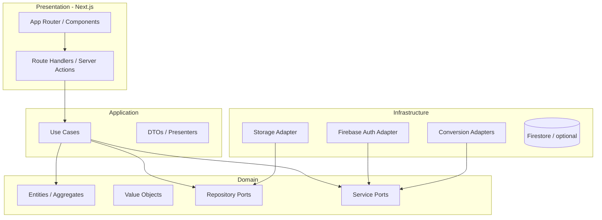

# Clean Architecture + DDD

Arquitetura base do [[Projeto Com Hans]].

## Por que combinar CA + DDD?

- **Clean Architecture** define *como* organizar dependências (domínio no centro, infra na borda).
- **DDD** define *o quê* modelar (linguagem ubíqua, bounded contexts, agregados).

Juntos: regras de negócio testáveis, conversores substituíveis e evolução mensal de formatos sem reescrever o core.

## Regra de dependência

**Regra:** código interno nunca importa código externo. Adapters implementam ports.

## Bounded Contexts

Ver detalhes em [[Bounded Contexts]].

| Context | Responsabilidade |
| --- | --- |
| **Conversão** | Catálogo de pares, jobs, status, resultado |
| **Identidade** | Sessão Firebase, usuário autenticado, quotas futuras |

Contextos se comunicam por **application services** ou **domain events** — evitar acoplamento direto entre agregados de contextos diferentes.

## Camadas

| Camada | Conteúdo | Proibido |
| --- | --- | --- |
| **Domain** | Entidades, VOs, erros de domínio, interfaces (ports) | Next, Firebase, ffmpeg, fs |
| **Application** | Use cases, orquestração, validação de entrada | Detalhes de libs externas |
| **Infrastructure** | Adapters (Firebase, S3/R2, conversores) | Regras de negócio |
| **Presentation** | Pages, components, route handlers finos | Lógica de conversão |

## Fluxo típico: converter arquivo

1. **Presentation** recebe upload + par desejado.
2. **Application** (`ConvertFileUseCase`) valida tamanho, MIME, par habilitado.
3. **Domain** cria `ConversionJob` com status `pending`.
4. **Infrastructure** persiste arquivo temp, executa adapter (ex.: `XlsxToCsvAdapter`).
5. **Application** atualiza job para `completed` ou `failed`.
6. **Presentation** retorna URL de download ou erro tipado.

## Testes

| Camada | Tipo |
| --- | --- |
| Domain | Unit puro (sem I/O) |
| Application | Unit com mocks de ports |
| Infrastructure | Integração (ffmpeg, sample files) |
| Presentation | E2E (Playwright) |

## Referências internas

- [[Camadas e Dependências]]
- [[Estrutura de Pastas]]
- [[Entidades e Value Objects]]
