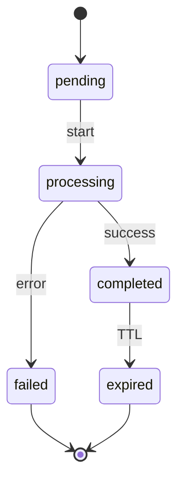

# Contexto Conversão de Arquivos

Bounded context principal do [[Projeto Com Hans]].

## Responsabilidade

Gerenciar o ciclo de vida de conversões de arquivos: validação, execução, resultado e expiração.

## Agregado: ConversionJob

```
ConversionJob
├── id: JobId
├── pair: ConversionPair
├── status: JobStatus
├── inputFile: TempFileRef
├── outputFile?: TempFileRef
├── userId?: UserId          # opcional no MVP anônimo
├── createdAt: Date
├── completedAt?: Date
└── failureReason?: string
```

### Transições de status



## Catálogo de pares

Centralizado em `ConversionCatalog` — fonte única para UI e use cases.

```typescript
// Exemplo conceitual
const MVP_PAIRS = [
  { source: 'xlsx', target: 'csv' },
  { source: 'csv', target: 'xlsx' },
  { source: 'docx', target: 'pdf' },
  { source: 'pdf', target: 'txt' },
  { source: 'json', target: 'csv' },
  { source: 'csv', target: 'json' },
  { source: 'video', target: 'mp3' },
];
```

Novos pares entram via [[Progressão Mensal]] sem alterar entidades — apenas o catálogo e novos adapters.

## Regras de domínio

1. Par deve existir e estar `enabled` na release.
2. Tamanho do arquivo ≤ limite do par (vídeo pode ter limite maior configurável).
3. MIME/extensão deve ser compatível com `source`.
4. Job `failed` não gera URL de download.
5. Arquivos expiram após TTL (padrão: 1 hora).

## Ports expostos

| Port | Métodos |
| --- | --- |
| `ConversionJobRepository` | save, findById, updateStatus |
| `FileStoragePort` | storeTemp, getSignedUrl, delete |
| `FileConverterPort` | supports, convert |

## Eventos de domínio (futuro)

- `ConversionCompleted` → analytics, notificação
- `ConversionFailed` → alerta ops
- `VideoConvertedToAudio` → gatilho para fila de transcrição IA

Ver [[Casos de Uso (MVP)]] para orquestração.
