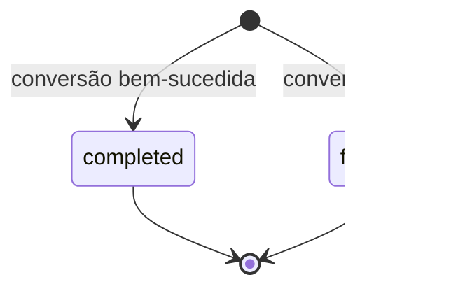

# Contexto Conversão de Arquivos

Bounded context principal do [[Projeto Com Hans]].

> **Atualizado em 2026-07-25 (Fase 2).** A versão anterior deste documento descrevia um
> desenho aspiracional — job assíncrono com `pending`/`processing`, `TempFileRef`,
> `FileStoragePort` — que nunca chegou a ser implementado dessa forma. O que segue descreve
> o agregado **como ele existe no código hoje**; a seção final marca o que ainda é futuro.

## Responsabilidade

Validar o upload, executar a conversão e registrar o resultado. **Não** gerencia mais um
ciclo de vida `pending → processing → completed`: a conversão é **síncrona** —
`POST /api/convert` recebe os bytes, converte via `FileConverterPort` e devolve o resultado
na mesma request. O agregado `ConversionJob` só existe **depois** que a conversão já
aconteceu; ele registra o resultado (sucesso ou falha), não o orquestra.

## Agregado: ConversionJob

Definido em `src/domain/conversion/entities/conversion-job.ts`.

```typescript
class ConversionJob {
  readonly id: string;
  readonly userId: string;
  readonly displayName: string;      // nome legível do arquivo — vem do usuário
  readonly fileNameHash: string;     // sha256[0..12) — o que vai para log, nunca displayName
  readonly from: AcceptedExtension;
  readonly to: AcceptedExtension;
  readonly category: ConversionCategory;   // "spreadsheets" | "data" | "documents" | "media"
  readonly engine: ConversionEngine;       // "server" | "client"
  readonly sizeBytes: number;
  readonly outputSizeBytes: number | null; // não-null apenas quando status = "completed"
  readonly status: ConversionStatus;       // "completed" | "failed"
  readonly durationMs: number;
  readonly errorCode: string | null;       // não-null apenas quando status = "failed"
  readonly createdAt: Date;
  readonly storageKey: string | null;      // sempre null hoje — reservado p/ Fase 3
  readonly expiresAt: Date | null;         // sempre null hoje — reservado p/ Fase 3
}
```

Construção só por **factory estático**, nunca `new` direto: `ConversionJob.completed(input)`
ou `ConversionJob.failed(input)`. Cada factory valida invariantes na criação (`userId` não
vazio, `sizeBytes`/`durationMs` não negativos, `outputSizeBytes` presente se e só se
`completed`, `errorCode` presente se e só se `failed`) e lança `Error` de domínio se
violadas. Não existe método de mutação — uma vez criado, o job é imutável; não há
`updateStatus` porque não há transição a fazer.

### Por que não há `pending`/`processing`/`expired`

O desenho antigo (docs pré-Fase 2) modelava um ciclo de vida completo porque previa jobs
assíncronos com storage e download por link. O que foi implementado é mais simples: a
conversão inteira acontece dentro de uma única request HTTP, e só ao final — sucesso ou
falha — um `ConversionJob` é criado já em estado terminal. Não existe "job em andamento"
para consultar, então não existe status intermediário. Ver
[[Decisão - Storage Temporário e TTL]] para quando (Fase 3) um fluxo assíncrono com
`storageKey`/`expiresAt` preenchidos justificar estados adicionais.



### `RecordConversionUseCase` nunca lança

O use case que persiste o `ConversionJob` (`src/application/conversion/history/record-conversion.use-case.ts`)
captura qualquer erro do repositório e só loga (`history-service` / `conversion_record_failed`) —
nunca propaga. Motivo: uma falha ao gravar o histórico não pode derrubar uma conversão que
já foi entregue ao usuário. O `fileNameHash` é calculado aqui (não na entidade), com
`node:crypto`.

## Catálogo de pares

Centralizado em `CONVERSION_PAIRS`, em
`src/domain/conversion/value-objects/conversion-pair.ts` — fonte única para UI e use cases:

```typescript
interface ConversionPair {
  readonly from: AcceptedExtension;
  readonly to: AcceptedExtension;
  readonly category: ConversionCategory;
  readonly live: boolean;   // false = anunciado como "em breve", rejeitado no convert
  readonly engine: ConversionEngine;  // "server" (adapter no backend) | "client" (ffmpeg.wasm)
}
```

Pares `live: true` e `engine: "server"` hoje: `csv↔xlsx`, `csv↔json`, `xlsx→json`,
`pdf→txt`, `docx→pdf`. Pares `engine: "client"` (mídia, ffmpeg.wasm no navegador, nunca
sobem ao servidor): `mp4`/`webm`/`mov` → `mp3`/`wav`. `pdf→docx` está no catálogo com
`live: false` ("em breve"). Ver [[Matriz de Conversões]].

Novos pares entram via [[Progressão Mensal]] sem alterar o agregado — apenas o catálogo e
novos adapters (`FileConverterPort`).

## Regras de domínio

1. Par deve existir no catálogo, estar `live` e ter `engine: "server"` para ser aceito por
   `POST /api/convert` (`isSupportedPair`).
2. Tamanho do arquivo ≤ `MAX_DOCUMENT_SIZE_MB` (documentos/dados) — validado por
   `ValidateUploadUseCase` antes de converter. Vídeo tem limite próprio, mas é validado e
   convertido no navegador (nunca sobe ao servidor).
3. Magic bytes do conteúdo devem ser compatíveis com a extensão declarada — rejeita
   binário/executável disfarçado de `.csv`/`.json`/`.pdf` etc.
4. `ConversionJob` com `status: "failed"` sempre tem `errorCode` e nunca tem
   `outputSizeBytes`; `"completed"` é o inverso — invariante validada no construtor.
5. `POST /api/upload`, `/api/preview` e `/api/convert` exigem sessão (`requireSession()`) —
   ver [[Contexto Autenticação]]. Não existe mais conversão anônima (era permitida antes da
   Fase 2; fechado como correção de segurança — ver [[MVP - Conversões Iniciais]]).

## Ports expostos

| Port | Métodos | Implementação |
| --- | --- | --- |
| `FileConverterPort` | `from`, `to`, `convert(bytes): Promise<Uint8Array>` | um adapter por par, registrado no `ConverterRegistry` |
| `ConversionJobRepositoryPort` | `save`, `listByUser`, `statsByUser`, `countByUserSince` | `FirestoreConversionJobRepository` (`users/{uid}/conversions/{jobId}`) |
| `FileStoragePort` | — | **não existe ainda** (Fase 3) |

Sem `findById`/`updateStatus` no repositório de histórico: o job é escrito uma vez
(`save`) e nunca mais alterado — não há necessidade de buscar por id nem de mutar status.

## Histórico — só metadados

`FirestoreConversionJobRepository` grava só metadados; **nenhum arquivo é armazenado**.
`storageKey`/`expiresAt` existem no snapshot desde já, sempre `null`, para a Fase 3 (storage
de arquivo + TTL) entrar sem exigir migração — ver [[Decisão - Storage Temporário e TTL]].

Conversões de mídia (vídeo→áudio, `engine: "client"`) rodam inteiramente no navegador; o
resultado é reportado ao histórico via `POST /api/conversions` — validação zod estrita,
checagem de `isClientConvertiblePair` e rate limit de 60/h por usuário. O reporte é
best-effort no client: se falhar, não interrompe nem avisa o usuário (a conversão em si já
terminou com sucesso).

## Eventos de domínio

Não implementados. A ideia original (`ConversionCompleted`, `ConversionFailed`,
`VideoConvertedToAudio` como eventos de domínio publicados) foi substituída, na prática, por
**logs estruturados** (`conversion_started`/`conversion_completed`/`conversion_failed` via
`LoggerPort`) e pela gravação direta do `ConversionJob` — sem barramento de eventos. Ver
[[Decisão - Observabilidade e Logs Estruturados]]. Um barramento de eventos real só se
justifica quando houver consumidores assíncronos de fato (ex.: gatilho de transcrição IA);
até lá seria complexidade sem consumidor.

Ver [[Casos de Uso (MVP)]] para orquestração.
