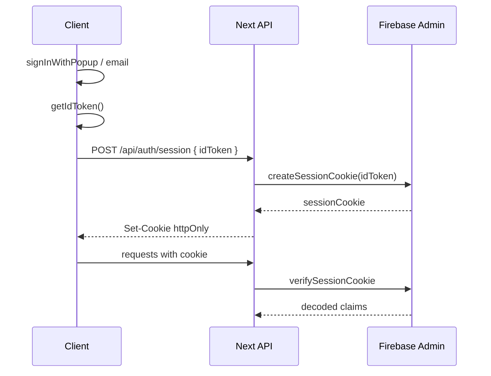

# Firebase Auth

Controle de sessão do [[Projeto Com Hans]] via Firebase Authentication.

## Papel no projeto

Firebase **não** é o domínio — é adapter de infraestrutura para o contexto [[Contexto Autenticação]].

## Provedores sugeridos (MVP)

1. Google
2. Email/senha (opcional no MVP)
3. GitHub (fase 2)

## Fluxo de sessão (session cookies)



## Pacotes

| Pacote | Uso |
| --- | --- |
| `firebase` | Client SDK (login UI) |
| `firebase-admin` | Server — verify/create session |

## Variáveis de ambiente

```bash
# Client (NEXT_PUBLIC_)
NEXT_PUBLIC_FIREBASE_API_KEY=
NEXT_PUBLIC_FIREBASE_AUTH_DOMAIN=
NEXT_PUBLIC_FIREBASE_PROJECT_ID=
NEXT_PUBLIC_FIREBASE_APP_ID=

# Server only
FIREBASE_PROJECT_ID=
FIREBASE_CLIENT_EMAIL=
FIREBASE_PRIVATE_KEY=
```

Ver [[Ambientes e Deploy]].

## Adapter

```
src/infrastructure/auth/firebase-auth.adapter.ts
```

Implementa `AuthSessionPort`:

- `verifySessionCookie` → `AuthenticatedUser`
- `createSessionCookie` (max age: 5 dias — ajustável)
- `revokeRefreshTokens` no logout

## Middleware

Cookie name: `__session` (convenção Firebase + Next).

## Firestore (opcional, fase 2)

Persistir histórico de jobs:

```
users/{uid}/conversions/{jobId}
```

Não misturar com Auth — apenas referência cruzada por `userId`.

## Segurança

- Regras Firestore: usuário só lê/escreve seus documentos.
- Admin SDK apenas no server.
- Rotacionar service account keys via GitHub Secrets.
