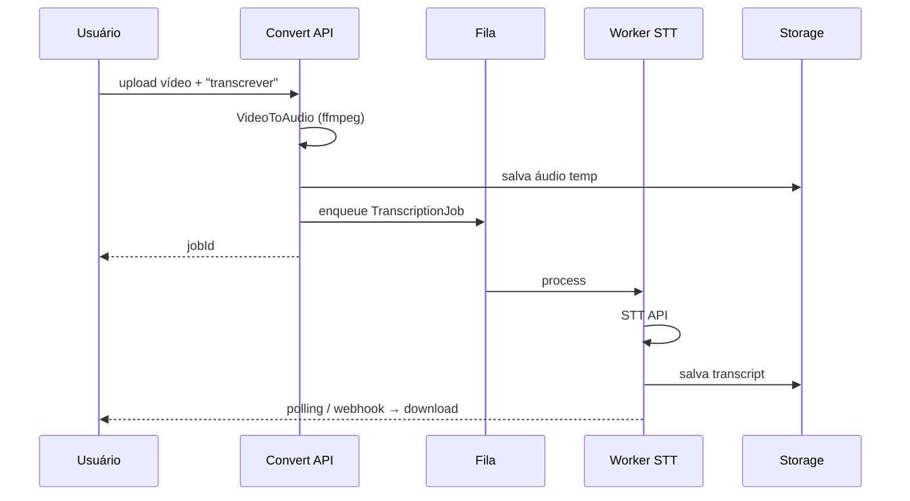

# Transcrição de Vídeo com IA

Feature futura do [[Projeto Com Hans]] — **fora do MVP**.

## Visão

Permitir upload de vídeo (ou áudio) e receber transcrição com timestamps, exportável em `txt`, `srt` ou `vtt`.

## Por que contexto separado?

- Pipeline assíncrono longo (minutos).
- Custo por minuto de áudio (API Whisper / Google STT / AssemblyAI).
- Modelo de domínio distinto: `TranscriptionJob`, `Segment`, `Speaker` (fase avançada).

Ver [[Bounded Contexts]].

## Fluxo proposto



## Integração com conversão existente

1. Reutilizar `FfmpegVideoToAudioAdapter` como pré-pass.
2. Evento `AudioExtracted` dispara `TranscribeMediaUseCase`.
3. UI: aba "Transcrever" além de "Converter".

## Provedores candidatos

| Provedor | Prós | Contras |
| --- | --- | --- |
| OpenAI Whisper API | Qualidade, simples | Custo, dados na OpenAI |
| Google Cloud STT | Escala, pt-BR | Setup GCP |
| AssemblyAI | Timestamps, speakers | Custo |
| Whisper local | Privacidade | Infra GPU |

**Recomendação inicial:** Whisper API com feature flag; avaliar local para plano enterprise.

## Modelo de domínio (rascunho)

```
TranscriptionJob
├── id
├── sourceVideoRef
├── audioRef
├── status
├── language?: 'pt' | 'en' | 'auto'
├── segments: TranscriptSegment[]
└── exports: { txt, srt, vtt }

TranscriptSegment
├── startMs
├── endMs
└── text
```

## Monetização (opcional)

- Minutos grátis / mês para logados
- Pay-per-minute para anônimos
- Quota via [[Contexto Autenticação]]

## Roadmap

| Fase | Entrega |
| --- | --- |
| v0.5 | Stub + fila + áudio→texto beta |
| v1.0 | Vídeo→transcrição completa + exports |
| v1.1 | Resumo IA + capítulos |

## Dependências

- Fila (BullMQ + Redis ou Cloud Tasks)
- Worker com ffmpeg + chamada STT
- [[Progressão Mensal]] mês 4–5

## Privacidade

- Consentimento explícito antes de enviar áudio a API externa
- Opção "processar localmente" (fase enterprise)
- TTL agressivo em arquivos de mídia
